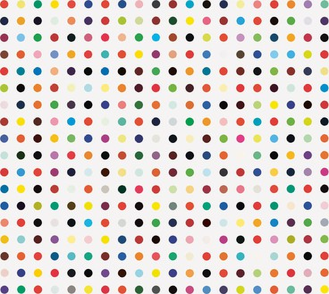

# Hirst painting
> Reproduction of The Dots by Damien Hirst.

## Table of contents
* [General info](#general-info)
* [Screenshots](#screenshots)
* [Technologies](#technologies)
* [Setup](#setup)
* [Status](#status)
* [Inspiration](#inspiration)

## General info
This simple painting was great as a initial project with Turtle library.
The main target was to get familiar with this GUI library.

The program generates dots, of a definable size, on the canvas. The colours of the dots are drawn at random from the original image using the colorgram module.

## Screenshots

## Technologies
* Python 3.8
* Colorgram 1.2.0
* Turtle 3.9.5

## Setup
Install missing libraries if necessary.

## Status
Project is: _finished_.

## Inspiration
Project inspired by Damien Hirst, based on [The Dots](https://www.damienhirst.com/texts1/series/spots).
